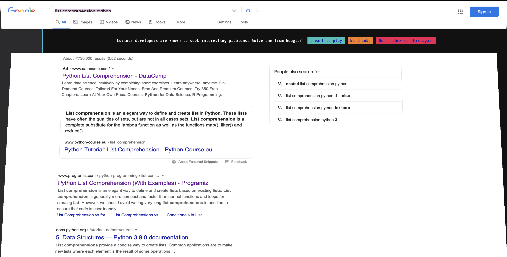
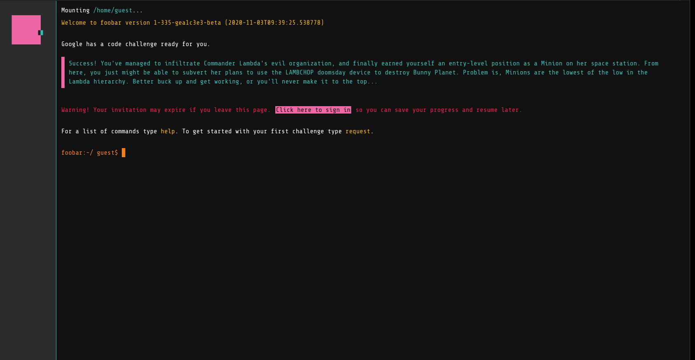
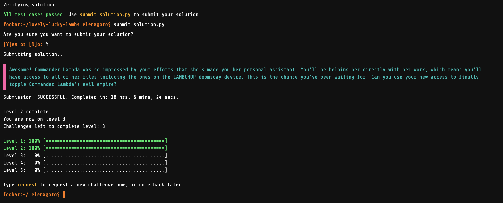

# My FooBar Challenge

Two weeks ago (Oct. 20, 2020\*\*), while looking, once again for _list comprehension in python_, my google results screen opened up...

And the message showed was this one:

This looked quite interesting, so, I decided to find out a little more about it. I discovered this is the [FooBar Challenge](https://towardsdatascience.com/how-to-get-hired-by-google-b19806ad3c62), Google's secret hiring process.

I have accepted the invitation and I have decided to document my process, as far as I'm able to go!

## About me

After several years in the world of humanities and museums, I decided to change my path and become a Web Developper. I knew this wasn't going to be easy, however, I had the great luck of finding [the school I needed to start my training](https://www.extensionschool.ch/), and I've been training in programming and Web development with them since 2019 (2018 if you count the intro courses!). This has made things a lot easier than expected 😊.

This means, however, that I'm very new to the world of programming! And all the mathematical knowledge I may need to complete this challenges is something I have yet to acquire. I'm sure that, even if I can't complete all the challenges, I'll learn a lot!

## Current status

Jan. 04, 2021 - After two months (The right time to complete my training - _Yay!_ - and give a proper end to the year!) I have requested a new challenge: **Prepare the Bunnies' Escape**! The problem can be found in the corresponding folder.

## Previous status

Nov. 03, 2020 - Today I completed the second challenge of the second level!

Level 1:

- [Minion Labor Shifts](https://github.com/elenagoto/foobar.withgoogle/tree/main/01_minion-labor-shifts)

Level 2:

- [Gearing Up for Destruction](https://github.com/elenagoto/foobar.withgoogle/tree/main/0201_gearing-up-for-destruction)
- [Lovely Lucky LAMBs](https://github.com/elenagoto/foobar.withgoogle/tree/main/0202_lovely-lucky-lambs)

Level 3:

- [Prepare the Bunnies' Escape](https://github.com/elenagoto/foobar.withgoogle/tree/main/0301_prepare-the-bunnies-escape)

\*\*_The screenshots are from two weeks later, when I got the invitation again. The first time I didn't even think about doing it!_
